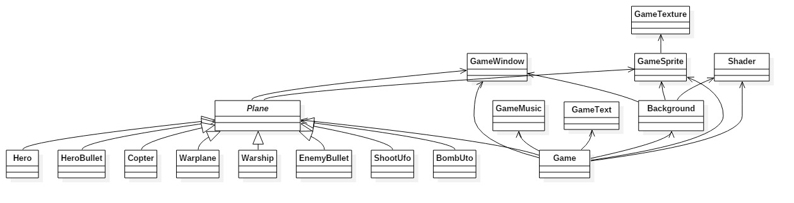
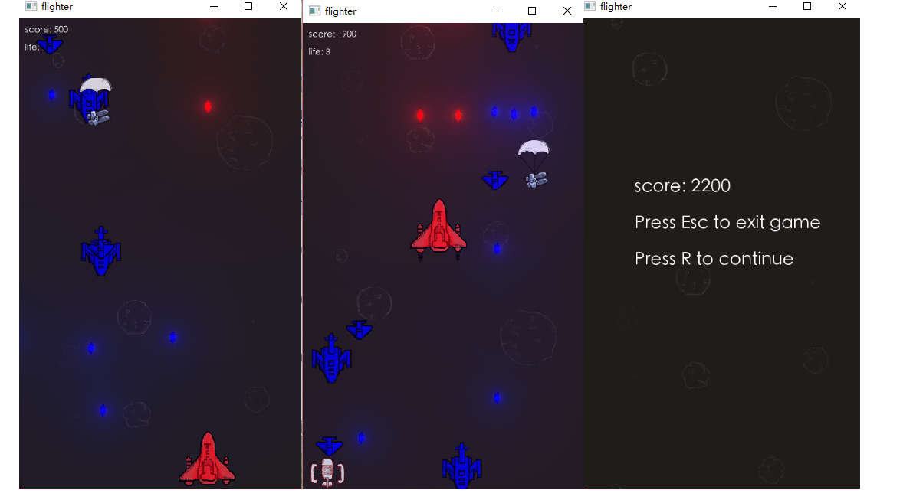

# 给谁做的？
---
单身狗
# 做什么？
---
玩家有3条命，用方向键控制移动，X键发弹，Z键使用炸弹，游戏过程中会随机产生敌机和道具，不同的敌机会发射不同的子弹，击毁敌机会得到相应的分数。随着游戏的进行，敌机产生的间隔，敌机的生命值会增加，游戏结束显示当前得分。没有关卡，没有boss。
# 怎么做
---
#### 配置SFML编译环境
* 在SFML官网相应位置下载适合当前编译器的图形库，并解压。
* 打开Code::Blocks，打开菜单Settings-Compiler...，选择GNU GCC Compiler，点击Copy，输入名字"SFML Compiler"，确定。
* 在Search directories下的Compiler添加SFML的include目录，在Linker添加SFML的lib目录。
* 在Linker settings下添加Link libraries："sfml-main"，"sfml-system"，"sfml-window"，"sfml-graphics"，"sfml-audio"。

#### 模块
|类名|功能|
|:--:|---|
|BackGround|控制背景的初始化，移动|
|BombUfo|炸弹的掉落，使用|
|Copter|直升飞机（敌机）的初始化，移动，发射子弹，爆炸，被击中|
|EnemyBullet|敌机的子弹的初始化，移动|
|Game|游戏的初始化，开始，结束|
|GameMusic|游戏音乐和音效的载入，播放|
|GameSprite|全局Sprite|
|GameText|游戏的文字显示|
|GameTexture|全局图像|
|GameWindow|游戏窗口的控制|
|Hero|玩家飞机的控制|
|HeroBullet|玩家发射的子弹的控制|
|Plane|飞机的基类，包含了飞机的基本操作，移动，爆炸等|
#### 关系

# 做的如何
---
#### 游戏截图

#### 程序运行状况
作品运行良好，没有掉帧的现象，帧率为60FPS。没有卡顿的现象，暂时没有发现BUG。
#### 玩家评价
游戏难度太低，很难死，因此趣味性较低。
